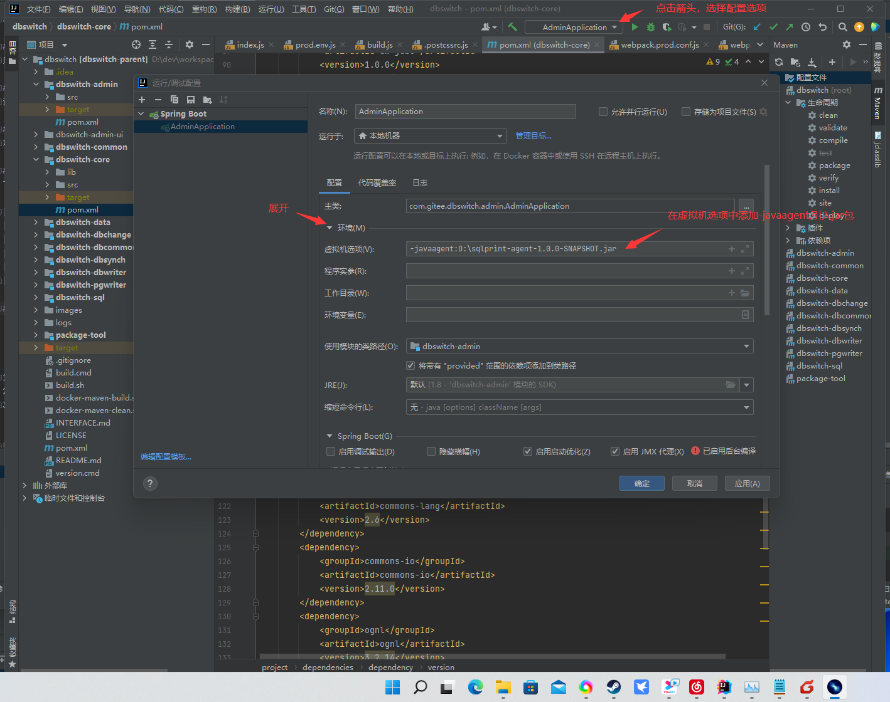
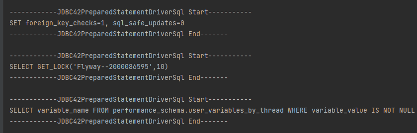
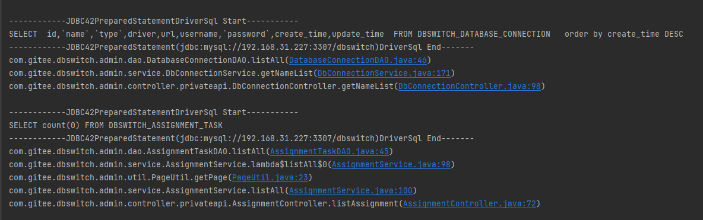

# sqlprint

## 一、介绍
用于输出执行运行过程中可直接执行的sql（特殊字段类型不能保证可运行），不受框架限制，新老项目都适用，方便阅读复杂项目，目前支持mysql、sqlserver、oracle、kingbase8。

## 二、技术实现
通过javassist对各数据库驱动中的statement关键方法处,注入代码,来实现sql输出。
## 三、适用场景
1、能加快了解复杂和不熟系的项目，直接从sql看出所作操作，而减少去翻阅代码  
2、开发过程中能更快定位因sql导致的问题，进而提高开发效率  
3、需要实现sql捕获的场景  

## 四、使用环境
项目jdk版本在1.6及以上，都能够使用。

## 五、支持数据库类型及驱动版本
下面是测试过的，驱动版本，未测试过的一般只要是Oracle,mysql,sqlserver,kingbase8.6这几个数据库的情况下，一般都可以使用。

| 数据库类型 | 驱动版本 |
| :-----| ---- |
| Oracle | 全版本支持 |
| Mysql  | mysql5.xxx,mysql8.xx | 
| Sqlserver  | sqljdbc4-4.0 | 
| kingbase8  | kingbase8.6 | 

## 六、使用说明
生成的jar的放在bulid目录下，可以直接下载使用。

    <!-- 
    如果通过javaagent方式使用，可以不引入， 但如果需要通过JarCodeInjectionUtils.injection生成class文件，则要引入此jar包 -->
    <dependency>
      <groupId>org.mfk.tools</groupId>
      <artifactId>sqlprint-agent</artifactId>
      <version>1.0.0-SNAPSHOT</version>
    </dependency>
    <!-- 核心包，需要引入 -->
    <dependency>
      <groupId>org.mfk.tools</groupId>
      <artifactId>sqlprint-core</artifactId>
      <version>1.0.0-SNAPSHOT</version>
    </dependency>


### 1、javaagent方式
需要增加jvm参数，引入agent包  
-javaagent:D:\sqlprint-agent-1.0.0-SNAPSHOT.jar
idea使用如下：

### 2、驱动class替换方式  
首先引入需要的驱动（如果是老的非maven项目，需要手工引入javaassist.jar）,然后运行  JarCodeInjectionUtils.injection("D:\temp") 方法，  
在相应的文件夹下，会生成全路径的class文件，替换进相应的jar包即可，达成目的后，可以移除agent的jar包。  
个别包有签名，如sqljdbc4-4.0，
需要修删除META-INF文件夹下MSFTSIG.SF和MSFTSIG.RSA，然后把MANIFEST.MF的清单都去掉，用rar软件修改保存即可）。  
如果是maven项目，则修改驱动后，移除原来的驱动，新建文件夹，引入修改后的驱动，例如：

       <dependency>
           <groupId>com.kingbase</groupId>
           <artifactId>kingbase-jdbc</artifactId>
           <version>8.6.0</version>
           <scope>system</scope>
           <systemPath>${project.basedir}/lib/kingbase8-8.6.0_mdf20220307.jar</systemPath>
       </dependency>

## 七、sql输出方面说明
默认sql输出使用DefaultSqlPrinterImpl.java  
输出下面的格式:  


可以自己照着DefaultSqlPrinterImpl方法实现自己想要的输出，或用获取到的sql实现其他业务，下面用开源项目dbswitch来做个例子：
新建DbswitchSqlPrintImpl.java，继承AbstractSqlPrinter，实现ISqlPrinter，并写自已需要的相关逻辑。
```
public class DbswitchSqlPrintImpl  extends AbstractSqlPrinter implements ISqlPrinter {
    @Override
    public void printSql(Statement statement, Object otherParams) throws Exception {
        IStatementSql isql = getStatementSql(statement, otherParams);
        String formatSql = getFormatSql(isql);
        StringBuffer sb = new StringBuffer();
        String sqlurl= (String) RefactUtils.getFieldValue(statement,"connection.myURL");
        sb.append("------------" + statement.getClass().getSimpleName() + "DriverSql Start-----------" + LINE);
        sb.append(formatSql + LINE);
        sb.append("------------" + statement.getClass().getSimpleName()+"("+sqlurl.substring(0,sqlurl.indexOf("?"))+")"+ "DriverSql End-------" + LINE);
        //sb.append("SqlParameters:" + StringUtilsExt.concatArraysToString(csarray, ",", "", "", 0) + LINE);
        sb.append(getStackTrace());
        System.out.println(sb);
    }
    public static String getStackTrace() {
        StringBuffer sb = new StringBuffer();
        int level = 3;
        int count = 0;
        int maxLine = 100;
        StackTraceElement[] stackTrace = (new Exception()).getStackTrace();

        for(int i = 0; i < stackTrace.length; ++i) {
            if (i >= level) {
                StackTraceElement s = stackTrace[i];
                String str = s.toString();

                if (str.indexOf(".java") > 10) {
                    if (str.indexOf("com.gitee.dbswitch")==-1)
                    {
                        continue;
                    }
                    sb.append(str + "\n");
                    ++count;
                    if (maxLine == count) {
                        break;
                    }
                }
            }
        }

        return sb.toString();
    }
}
```
然后在main方法中调用(设置一次即可，项目任意处)  SqlPrintHelper.setSqlPrinter 方法来设置输出实现
```
SqlPrintHelper.setSqlPrinter(new DbswitchSqlPrintImpl());
```
上图实现的输出sql效果如下，支持了代码定位，和输出了哪个库的URL输出的sql:

* @param className:数据库执行sql过程中，实际的类名
* @param statementSqlMapperClazz:对应数据库statement的sql提取实现
* String className, Class
## 八、重写实现或扩展数据库方式
| 方法 | 参数说明 | 方法说明 |
| :-----| :---- | :---- |
| SqlPrintHelper.addStatementSqlImpl | String className:数据库执行sql过程中<br>Class statementSqlMapperClazz:对应数据库statement的sql提取实现，需实现IStatementSql | 添加sql获取实现，可覆盖包内原始实现，或新增新数据库实现|
| AgentConfig.register  | String key:类路径 <br> Class<ICodeInjection> clazz：代码注入实现类，需实现ICodeInjection接口 |添加对应statement的代码注入实现 |

## 九、项目在两个平台上的地址
gitee:https://gitee.com/mfkvfhpdx/sqlprint  
github:https://github.com/mfkvfhpdx/sqlprint